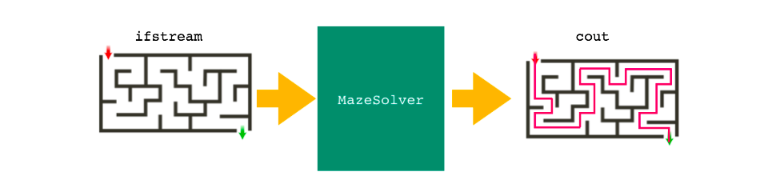
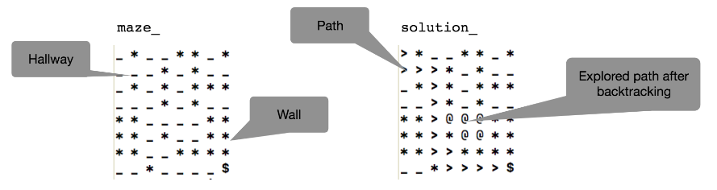

**This was the school project, using given algorithm - stack to implement the maze solver.cpp file**  
 
# MAZE SOLVER

  

This maze solver will read the maze from an input file - , find a path that leads to the exit and print the solution to the standard output (solution = maze with highlighted path from start position to exit).

## Maze representation:
- '_': a hallway
- '*': a wall
- '$': an exit
- '>': a PATH towards the exit
- '@': a location that has been visited and then backtracked out of on the solution
- 'X': a location that has been visited on the maze

## Files:
- 1 Instrution file (Project4.pdf)
- 1 Excutable file (p)
- 1 Header file (MazeSolver.h)
- 1 Main file (Main.cpp)
- 1 Cpp file (MazeSolver.cpp)
- 5 Input files which are different maze styles 
  - Input.txt: 8x8 maze
  - InputB.txt: 16x4
  - InputC.txt: 4x3
  - InputD.txt: 6x6
  - InputE.txt: 8x8

## To run this program:
  1. Open the terminal and go to your directory where downloded this folder.
  2. Type ./p
  
  3. To see diffrent maze, need to modify Main.cpp:
     - MazeSolver solver("Input.txt"); // type any file name like InputB.txt instead of "Input.txt".
